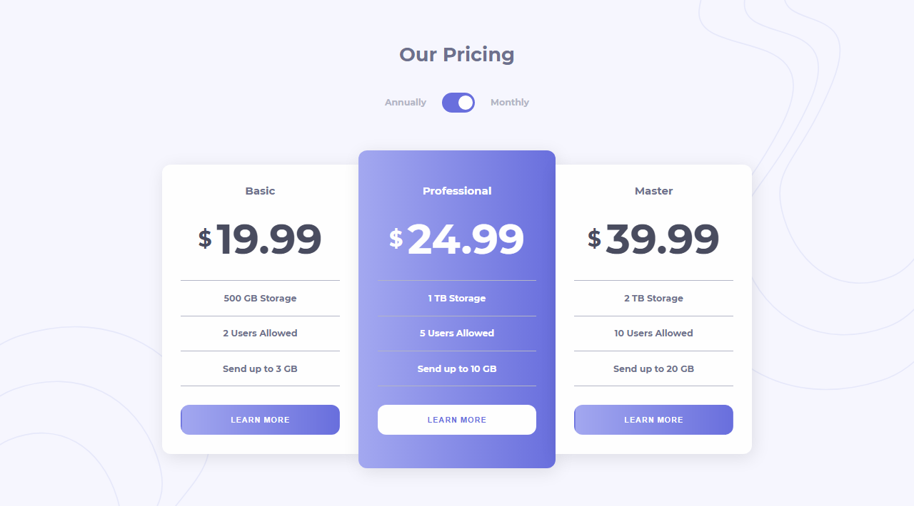

# Frontend Mentor - Pricing component with toggle solution

This is a solution to the [Pricing component with toggle challenge on Frontend Mentor](https://www.frontendmentor.io/challenges/pricing-component-with-toggle-8vPwRMIC). Frontend Mentor challenges help you improve your coding skills by building realistic projects.

## Table of contents

- [Overview](#overview)
  - [The challenge](#the-challenge)
  - [Screenshot](#screenshot)
  - [Links](#links)
- [My process](#my-process)
  - [Built with](#built-with)
- [Author](#author)

## Overview

### The challenge

Users should be able to:

- View the optimal layout for the component depending on their device's screen size
- Control the toggle with both their mouse/trackpad and their keyboard
- **Bonus**: Complete the challenge with just HTML and CSS

### Screenshot

Here is a screenshot of the solution.

### Links

- Solution URL: [Solution](https://www.frontendmentor.io/solutions/pricing-component-with-toggle-switcher-3mqfSgbQn)
- Live Site URL: [Live Site](https://pricing-component-toggle-switcher.netlify.app/)

## My process

### Built with

- Semantic HTML5 markup
- CSS custom properties
- Flexbox

## Author

- Frontend Mentor - [@JhoellOpeyemi](https://www.frontendmentor.io/profile/JhoellOpeyemi)
- Twitter - [@iam_jhoell](https://www.twitter.com/iam_jhoell)
